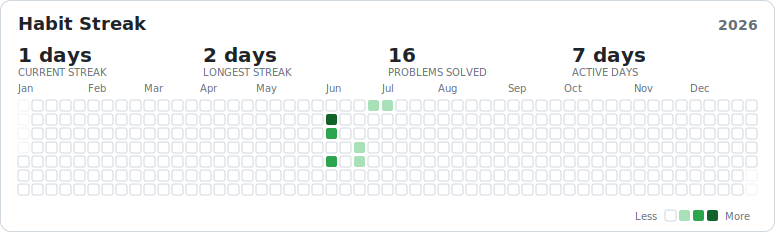

# NeetCode Solutions — @saitarrun

My [NeetCode.io](https://neetcode.io) solutions, auto-synced via GitHub Sync.

## 🔥 Habit Streak

[](https://saitarrun.github.io/neetcode-submissions/)

> Updates on every submission · **[Interactive version →](https://saitarrun.github.io/neetcode-submissions/)**

## Structure

Solutions are grouped by topic, then problem, with one file per submission:

```
Data Structures & Algorithms/<problem>/submission-0.py
```

Each `Add:` commit counts as one submission; the badge and stats rebuild automatically from git history.
